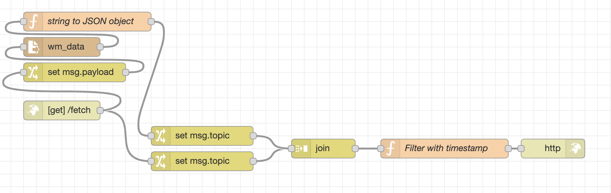
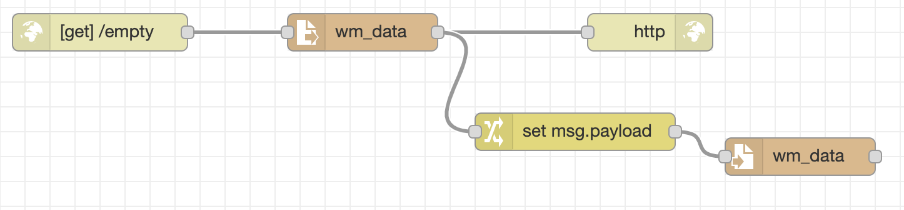
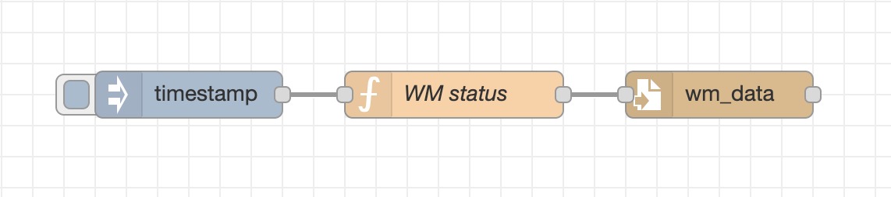

# Raspberry PI software

Node-RED code is located in [flow.json](flow.json) and it is easily importable to the program. The data from washing machine is written in certain file `wm_data`, in the format of entries with fields `timestamp` and `status` denoting the timestamp and status whether washing machine was working respectively.

## Endpoints

`/fetch`

**Request**: `GET`

**Input**:
- `timestamp : String` - A string denoting timestamp, i.e. the time in seconds passed from Jan 1, 1970 (Unix time).

**Output**:

- JSON array of objects:

```javascript
{
    timestamp: "1576222681077",
    status: true
}
```

Fetches the data and returns all data entries whose timestamps are **strictly** greater than the input timestamp.



`/file`

**Request**: `GET`

**Output**:
- A string which denotes the content of the file where the washing machine data is written.

Gets the content of the data file of washing machine.


`/empty`

**Request**: `GET`

**Output**:
- A string which denotes the content of the file where the washing machine data is written.

Empties the content of the data file of washing machine.



## Notes

It is possible to emulate the behavior of washing machine with this flow below through inject component:

